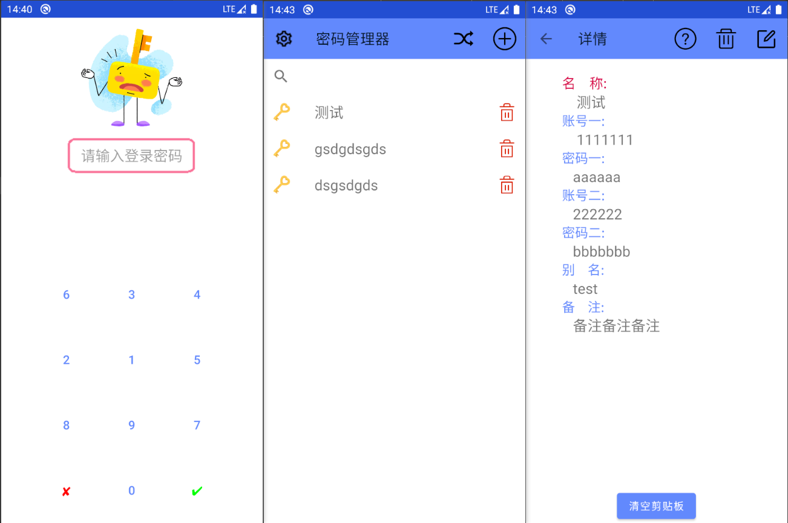

# PasswordManager

基于Android/PC的离线版密码管理器

项目地址：[源--https://github.com/HibaraAi/password](https://github.com/HibaraAi/password)

​                  [镜像--https://gitee.com/HibaraAi/password](https://gitee.com/HibaraAi/password)

## 一. 简介

```java
重点关注：
1. 软件单机运行，不需要联网
2. 支持加密
3. 有txt导出，可以跨设备迁移数据
```

本软件是一个简易的Android端密码管理器，同时具有随机密码生成功能。所有数据都加密存储，支持跨设备数据迁移（未来会出一个电脑端，使用同一个备份文件恢复），此外，软件设有启动密码。兼容性上，Android的最低版本必须为Android10，如果鸿蒙的Android版本也是10以上则鸿蒙也可以安装使用。

## 二. 软件截图



## 三. 待解决

1. 电脑端尚未制作，打算使用JavaFx写界面，数据存储方面自己写io访问磁盘文件

## 四. 联系

QQ: 3192233122（注明添加缘由）

Email: 3192233122@qq.com